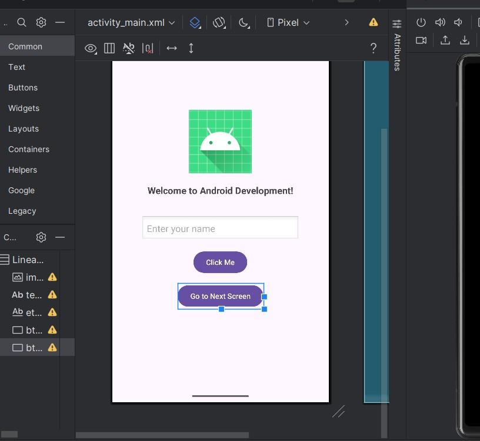
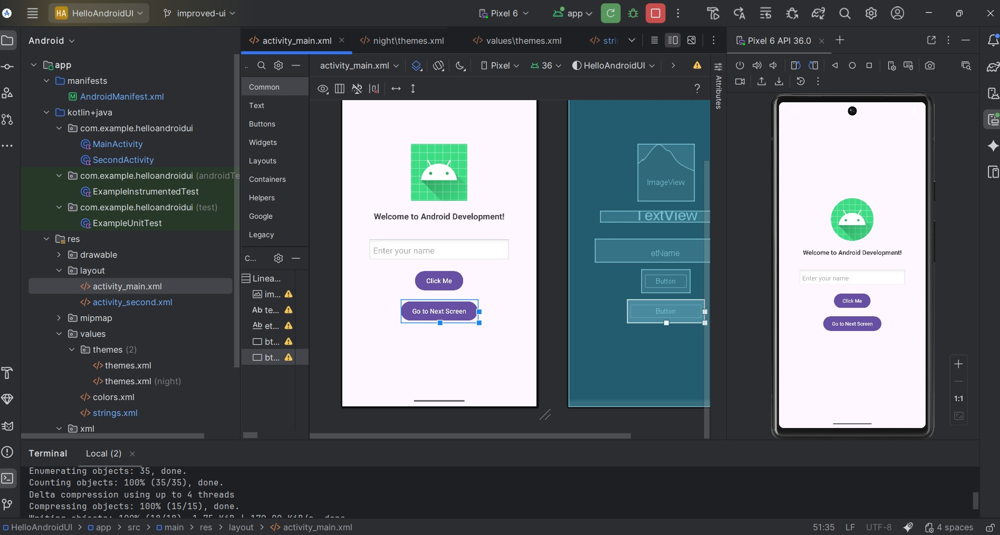

# 📱 HelloAndroidUI – Mobile Application Development  
### Lab Activity 01 – Base App + Improved UI

This repository contains the implementation of **Lab Activity 01**, demonstrating Android UI development using XML layouts, user interaction, Intents, Activity navigation, themes, and UI enhancements.

The improved version is implemented in the **`improved-ui`** branch, as required in the assignment.

---

## ✅ 1. Base Application Features

- **TextView**: Displays *“Welcome to Android Development!”*
- **Button**: Shows a Toast message
- UI created using **XML Views** (non-Compose)
- Compatible with **API 26+**

---

## 🚀 2. Improved UI Features (4 Enhancements Added)

### ✔️ ImageView  
Added an Android logo/profile image at the top of the screen.

### ✔️ EditText + Personalized Toast  
User enters their name → Button click shows a custom greeting.

### ✔️ Second Activity + Intent  
Created `SecondActivity` and passed user input using Intent extras.

### ✔️ Material3 Theme  
Applied Material Design styling for a modern UI experience.

---

## 🧭 3. App Navigation Flow

1. **MainActivity**  
   - Enter user name  
   - Tap *Click Me* → personalized Toast  
   - Tap *Go to Next Screen* → navigate to second page  

2. **SecondActivity**  
   - Displays name passed via Intent  
   - Includes a *Back to Main* button (using `finish()`)

---

## 📸 4. Screenshots

### **Main Activity**
  
*Home screen with Android logo, input field, and navigation button*

### **Personalized Toast**
  
*Custom greeting message when user submits their name*

### **Second Activity**
  
*Second screen displaying personalized message passed via Intent*

---

## 🌳 5. Git Branch Structure

| Branch | Description |
|--------|-------------|
| `main` | Base version of the app |
| `improved-ui` | Enhanced UI version with all improvements |

---

## 🛠️ 6. Technologies Used

- Kotlin  
- XML Layouts (ConstraintLayout)  
- Intents & Activities  
- Material3 Theme  
- Android Studio  
- Min SDK: 26  

---

## 🧪 7. How to Run the App

```bash
git clone https://github.com/kishan-ctrl/HelloAndroidUI.git
cd HelloAndroidUI
git checkout improved-ui
